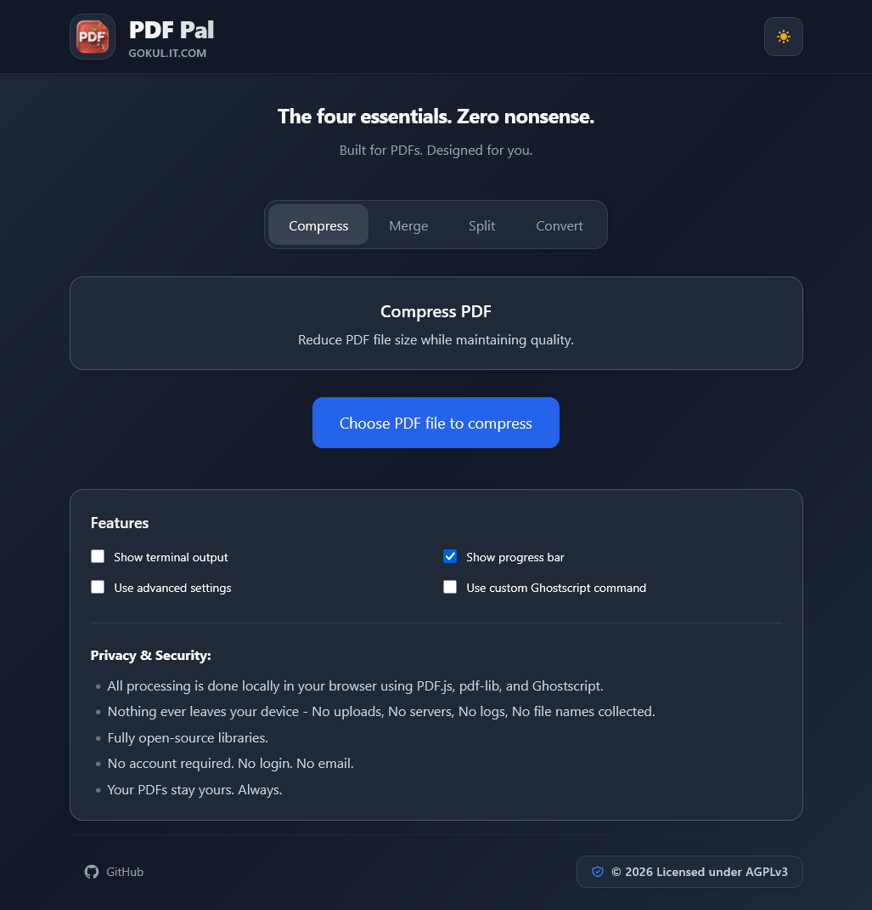

# PDF Pal 🦥

<div align="center">

**A fast, secure, and privacy-first web app for all your PDF needs.**

[](https://www.gnu.org/licenses/agpl-3.0)
[](https://react.dev/)
[](https://vitejs.dev/)
[](https://tailwindcss.com/)

*Just the four essentials. Zero nonsense. Built for PDFs. Designed for you.*

</div>

---

## Preview

| Dark Mode | Light Mode |
|---|---|
|  |  |

---

## Overview

**PDF Pal** runs entirely in your browser — no servers, no uploads, no tracking. It leverages WebAssembly (Ghostscript) and modern JavaScript libraries to give you powerful document tools with complete privacy.

## Features

- 🗜️ **Compress PDF** — Drastically reduce file sizes while maintaining reading quality. Upload and compress multiple PDFs in one go.
- 🔗 **Merge PDFs** — Combine multiple documents into a single PDF with drag-and-drop reordering to arrange pages exactly how you want.
- ✂️ **Split PDF** — Extract specific page ranges from larger documents in seconds.
- 🔄 **Convert**
  - *PDF → Images*: Extract every page into high-quality PNGs or JPEGs.
  - *Images → PDF*: Combine multiple images into a unified, standardized PDF with drag-and-drop reordering before conversion.
- 🌙 **Dark Mode** — Respects your system preferences automatically.

## 🔒 Security & Privacy First

Your documents are your business.

| Guarantee | Details |
|---|---|
| **Zero Uploads** | Everything runs 100% locally on your device. No cloud, no servers, no data collection. |
| **Strict Validation** | Enforces 200MB size limits and uses magic-byte validation (`%PDF-`) to reject corrupted or malicious files. |
| **Orphaned Thread Protection** | Web Workers are explicitly garbage-collected after every operation to keep your browser running fast. |

## Getting Started

### Prerequisites

- [Node.js](https://nodejs.org/) v18+
- npm or yarn

### Run Locally

```bash
git clone https://github.com/Gokul-Sloth/PDF-Pal.git
cd PDF-Pal
npm install
npm run dev
```

### Build for Production

```bash
npm run build
npm run preview
```

## 🛠️ Tech Stack

| Layer | Technology |
|---|---|
| **Frontend** | React 18, Vite, Tailwind CSS |
| **PDF Manipulation** | `pdf-lib` — document properties & generation |
| **Rendering** | `pdfjs-dist` (PDF.js) — canvas rendering & image extraction |
| **Compression / Merge / Split** | Ghostscript WebAssembly (`pdf-compress.wasm`) — native-grade processing in the browser |

## Project Structure

```
PDF-Pal/
├── public/
│   └── pdf-compress.wasm     # Ghostscript WebAssembly binary
├── src/
│   ├── components/           # Reusable UI components
│   ├── features/             # Core PDF tool logic (compress, merge, split, convert)
│   ├── workers/              # Web Worker definitions
│   └── main.jsx
├── index.html
└── vite.config.js
```

> **Note:** Update this tree to match your actual project layout.

## Contributing

Contributions, issues, and feature requests are welcome!

1. Fork the repository
2. Create a feature branch (`git checkout -b feature/amazing-feature`)
3. Commit your changes (`git commit -m 'Add amazing feature'`)
4. Push to the branch (`git push origin feature/amazing-feature`)
5. Open a Pull Request

## 📄 License

Code licensed under **AGPLv3** (2026).

This project is licensed under the [GNU Affero General Public License v3.0](https://www.gnu.org/licenses/agpl-3.0.html) — see the [LICENSE](LICENSE) file for details.

Ghostscript is released by Artifex under AGPLv3. Learn more at [ghostscript.com](https://www.ghostscript.com/).
